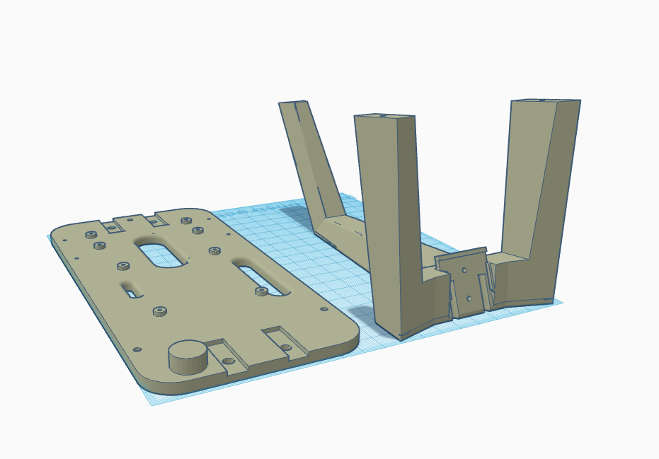
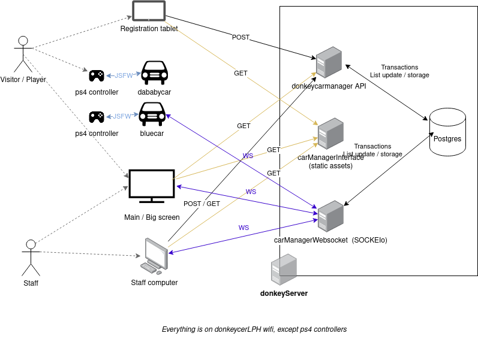
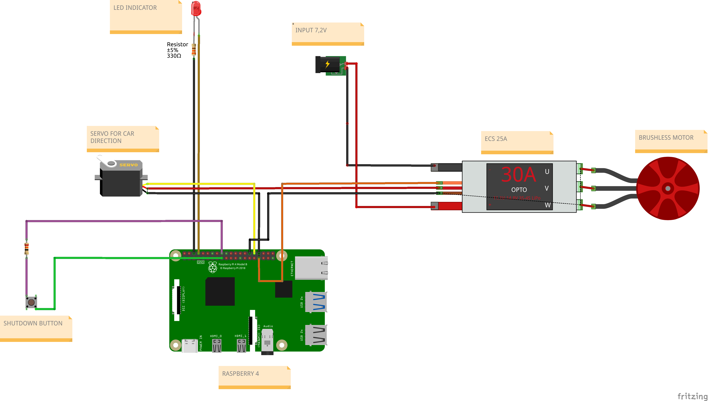

<div align="center">
<h1> donkeycar LPH </h1>


### In this project we present a solution to industrialize the production of donkeycar car raspberry pi images and allow everyone to be able to install easily the donkeycar environnement. We have also added some tools like our manager to make public demonstrations, led several donkleycars to the public having now knowledge of the project, register for a driving session (have an estimated waiting time), drive with multiple cars at the same time and see in live on a huge screen their time lapses, start a recorded driving then view their own model in action (without handling transfers ...).
</div>
<br>

 > 💡 Inspirated and use the original [donkeycar project](https://github.com/autorope/donkeycar)
 
 <br>

<details>	
  <summary><b> 🚀 How to use our project</b></summary>

## 🧰 Build your own donkeycar 

***

Before use our project you need to build your donkeycar.
If you don't have a donkeycar, please follow this [tutorial](https://docs.donkeycar.com/guide/build_hardware/) made by donkeycar community

### **Tips :**
If you using wide angle camera like [this](https://www.kubii.fr/cameras-capteurs/2207-module-camera-5mp-grand-angle-kubii-3272496011205.html), we have modelize on the chassis a camera cap holder. Convenient to avoid losing it

> 📒 [open](3dDesigns/camera-cover/preview.png) chassis stl file


## 🧪 Create your ansible recipe

*** 
If you wanted to use our features and improvements you should create your own recipe book with your wanted recipes. Indeed, ansible has a configuration file where we specifie what options ( recipe ) we want, so you have to modify the [donkeycar.yml](ansible/donkeycar.yml) file and comment recipes you don't want

```yml
 roles:
    - role: raspi-config #rasperry pi configuration role
      become: yes # This role need root privileges
    - role: car-config # car configurations (ntp, hostname, ds4drv...)
      become: yes # This role need root privileges
    - role: shutdown-btn # shutdown button service
      become: yes # This role need root privileges
    - role: ps4-controller # install and configure ds4drv
      become: no # This role no need root privileges
    - role: openCV # Install openCV (optional)
      become: yes # This role need root privileges
    - role: donkeycar # Donkeycar installation 
      become: no # This role doesn't need root privileges
    - role: mycar # create car with configurations
      become: no # This role no need root privileges
    - role: IR-lap-timer # install dependencies for take charge IR counter
      become: yes # This role need root privileges
```
> 📒 [ansible/donkeycar.yml](ansible/donkeycar.yml) preview

* `raspi-config` : defaults installations like wifi credentials, ssh ...
* `car-config` : car configurations (ntp, hostname, ds4drv...)
* `shutdown-btn` : add scripts for the shutdown button ( see [documentation](doc/boutton/Boutton_poussoir.md) and [schematic](doc/schema/schema-electronique.png) )
* `ps4-controller` : installation of ds4drv and configuration for ps4 bluetooth controllers
* `openCV` : install openCV according to donkeycar documentation
* `donkeycar` : install [donkeycar project](https://github.com/autorope/donkeycar) and its requirements 
* `mycar` : create mycar folder with its files
* `IR-lap-timer` : Infrared installation and configuration

**Don't comment required recipes (raspi-config, car-config, donkeycar, mycar ), this action can prevent the proper functioning of installations or configurations**

> ⚠️ Some features have hardware requirement. **Please read our [electronic schematic](doc/schema/schema-electronique.png)

## ⚙️ Modify default car configurations

***

- modify configuration for single car

  Before launching your recipe, you should modify config var with your configurations like `wpa_suplicant` to specify acces point name and credentials, donkeycar steering and throttle configuration
  > 📒 [ansible/group_vars/all](ansible/group_vars/all)

- configuration for multiple cars with the same image

You can configure the cars independently, in our case we have 4 configurations (see [ansible/config](ansible/config)).
To do this, you should specify add the car's hostname and mac address:
  > 📒 [ansible/config/hostnames](ansible/config/hostnames)
  ```text
  e4:5f:01:68:17:2c	dababycar
  ```
  afterwards, just create a folder with the car name at `ansible/config`. For our example we should create dababycar folder at `ansible/config/dababycar`.

  In this folder we should to create two file configuration :
   - `ds4drv.env` --> ps4 controller color
   - `myconfig.py` --> donkeycar myconfig

   example :
   > 📒 [ansible/config/dababycar/ds4drv.env](ansible/config/dababycar/ds4drv.env)
   ```env
  CONTROLLER_LED_COLOR=A103FC
   ```
  
  > 📒 [ansible/config/dababycar/myconfig.py](ansible/config/dababycar/myconfig.py)
   ```python
  DRIVE_TRAIN_TYPE = "PIGPIO_PWM" # SERVO_ESC|DC_STEER_THROTTLE|DC_TWO_WHEEL|SERVO_HBRIDGE_PWM|PIGPIO_PWM|MM1|MOCK

  STEERING_CHANNEL = 12           #channel on the 9685 pwm board 0-15
  STEERING_LEFT_PWM = 739         #pwm value for full left steering
  STEERING_RIGHT_PWM = 400        #pwm value for full right steering
  
  STEERING_PWM_PIN = 12           #Pin numbering according to Broadcom numbers
  STEERING_PWM_FREQ = 75          #Frequency for PWM
  STEERING_PWM_INVERTED = False   #If PWM needs to be inverted

  THROTTLE_CHANNEL = 13           #channel on the 9685 pwm board 0-15
  THROTTLE_FORWARD_PWM = 575      #pwm value for max forward throttle max 750
  THROTTLE_STOPPED_PWM = 470      #pwm value for no movement
  THROTTLE_REVERSE_PWM = 400      #pwm value for max reverse throttle

  THROTTLE_PWM_PIN = 13           #Pin numbering according to Broadcom numbers
  THROTTLE_PWM_FREQ = 75          #Frequency for PWM
  THROTTLE_PWM_INVERTED = False   #If PWM needs to be inverted

  AUTO_RECORD_ON_THROTTLE = False #if true, we will record whenever throttle is not zero. if false, you must manually toggle recording with some other trigger. Usually circle button on joystick.
  CONTROLLER_TYPE='custom' # Set the controller to be used to be our custom one ()

  LOGGING_LEVEL='DEBUG'
  ```
### Our schematic
***

After having created your ansible playbook, you can launch it with these two options :
- install it by ssh but you should configure manually internet, ssh and install ansible on your raspberry pi. **Follow this [tutorial](ansible/README.md)**
- generate your raspian image with donkeycar installed using packer.**follow this [tutorial](packer/README.md)**

## 👷 Build infrared transmitter

***

Our lap-timer is based on an infrared emitting tower, each car is counting it's lap timings and they are displayed in live in the DonkeyCar manager (public screen).
If you want to build your one, **you can follow this [documentation](IR-tower/README.md)**


## 🏎 Run our manager and happy race !

***

1 - Run our backend according to our [documentation](backend/README.md)

2 - Run our frontend according to our [documentation](donkeycarManagerFront/README.md)

About our architecture :



  <br/>	
</details>

<details>	
  <summary><b>✨ Our features</b></summary>
  <br/>	
 
## Software 

***

### Ansible remote installation documentation : 
  > we have made a ansible book for automate our donleycar and raspberry pi installation remotely (ssh).
    Indeed, these recipes allow us to have one single clean installation and be able to repeat it to infinity. <br>
    <b>ℹ️ Read [documentation](ansible/README.md) !! </b>

### Generate raspian image with donkeycar installation :
 > With ansible and packer, we can also generate a raspian image with our donkeycar installation. This feature is very usefull if we want to share it with people and don't use ssh. <br>
 <b>ℹ️ Read [documentation](ansible/README.md) !! </b>

### Donkeycar manager :
 > We have created a donkeycar manager. This manager is separated in to parts : a backend ( with database, api ...) and a frontend ( vuejs 2), it allow us to see cars who running, stopped, manage players who race... <br>
 <b>ℹ️ For more informations about how it works, you can see our documentation [here](doc/donkeycarManager/manager-features.md)</b>

## Hardware

***

<br>

### Our schematic : 



### PS4 controller Shortcuts
> We have created some shortcuts for easily make maintenance task like for test camera, shutdown car...
**See [documentation](doc/controller.md)**

### Shutdown button :
> we have made a shutdown button, for shutdown car manually because when ssh crash we can't make a clean shutdown and we risk to damage the SD card
**See [documentation](doc/button/shutdown-button.md)**

### Led indicator :
 > This led indicator allow us to know if the car is up or not. If the led is up, the car working.

### Infrared sensor
> we using `KY-022` sensor for our cars, It allow us to count laps when a car pass front of the infrared emitting tower

### Infrared emitting tower 
> For count laps in donkeycar manager, we should build a infrared emitting tower.
If you want to build your one, **you can follow this [documentation](IR-tower/README.md)**


## 3D designs 

***

### Anti-theft for ps4 controllers :
 >ℹ️ see [documentation](3dDesigns/car-chassis/README.md)

### Camera cap holder :
>ℹ️ see [documentation](3dDesigns/camera-cover/README.md)

</details>

<details>	
  <summary><b>📢 troubleshooting</b></summary>
  <br/>

  **Todo**

</details>