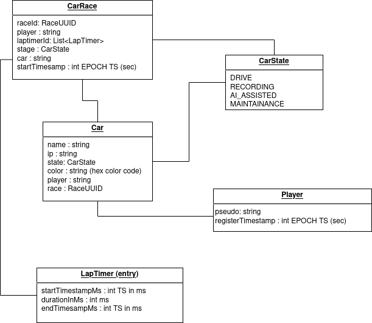

# DonkeyCarManager - Redis data structure

Base on features detailed here : [Donkey Car (booth) Manager Features](./redis-data-structure.md).

This document describe ressources and how they are stored in Redis.

## Visual representation of the concepts



## Ressources

### Car

Represent a booted car, `{{carname}}` is the hostname of the car.

| Field | Type | Description | Redis key name/pattern |
|--- |--- |--- |--- |
| ip | `string` | Current car IP addr. Eg: `192.168.1.200` | car:`{{carname}}`:ip |
| state | `'DRIVE'\|'RECORDING'\|'AI_ASSISTED'\|'MAINTAINANCE'` (string) | Current car IP addr. Eg: `192.168.1.200` | car:`{{carname}}`:state |
| color | `string` | Car color code HEX. Eg: `FF0000` | car:`{{carname}}`:color |
| player | `string` | Current player nickname/pseudo. Eg: `benvii` | car:`{{carname}}`:player |
| race | `string` | Current race UUID. Eg: `123e4567-e89b-12d3-a456-426614174000` | car:`{{carname}}`:race |

*Maybe [hashes](https://redis.io/docs/manual/data-types/data-types-tutorial/#hashes) should be used here.*


### Player

Represent a visitor that has registered with a unique `{{pseudo}}`.

| Field | Type | Description | Redis key name/pattern |
|--- |--- |--- |--- |
| registerTimestamp | EPOCH timestamp in seconds, `int` | Current car IP addr. Eg: `1652565920` | player:`{{pseudo}}`:register-timestamp |

*We might have more data to store about the player, for now i don't see more*.

*Maybe [hashes](https://redis.io/docs/manual/data-types/data-types-tutorial/#hashes) should be used here.*

## CarRace

Represent a race by a player, store under the key pattern `race:{{raceID}}`, each race has a unique ID it includes all data about a race. It's a Redis Hashes with :

| hashes field | Type | Description |
|--- |--- |--- |
| player | `string` | Race player pseudo. Eg: `benvii` |
| laptimerId | `string` | UUID of the LapTimer Redis List. |
| stage | `'DRIVE'\|'RECORDING'\|'AI_ASSISTED'\'` | Indicate the stage the race was made. Could be usefull in the futur to display bast AI driven player for instance. |
| car | `string` | Name of the car the race was made on. Eg : `dababycar` |
| startTimestamp | Epoch unix timestamp in sec `int` | Date when the race was started |


## LapTimer

LapTimers will be identified by an UUID stored in laptimers:`{{UUID}}` as a **Redis List**. Each list element is a JSON encoded payload, here is an exemple of the associated JSON playload :
```json
{
    "startTimestampMs": 1652649509126,
    "durationInMs": 35000,
    "endTimestampMs": 1652649544126
}
```

This is only one element of the list.

| Field (in JSON) | Type | Description | Redis key name/pattern |
|--- |--- |--- |--- |
| startTimestamp | EPOCH timestamp in ms, `int` | When the lap as started Eg: `{'startTimestamp': 1652565920, ...}` | laptimers:`{{UUID}}`[x], then inside the json |
| durationInMs | Duration in ms `int` | Duration of the lap Eg: `{'durationInMs': 35000, ...}` | laptimers:`{{UUID}}`[x], then inside the json |
| endTimestampMs | EPOCH timestamp in ms, `int` | End lap timestamp Eg: `{'endTimestampMs': 1652649544126, ...}` | laptimers:`{{UUID}}`[x], then inside the json |

### PlayerPool

Represent the waiting player list (linkedlist as we are using redis).

| Redis key name | Type | Description |
|--- |--- |--- | 
| playerpool | `List` | List of string, each value is the player nickname, new waiting players are added at the tail (last to be serve, last registered), old players (first in) should be pop from the head |
