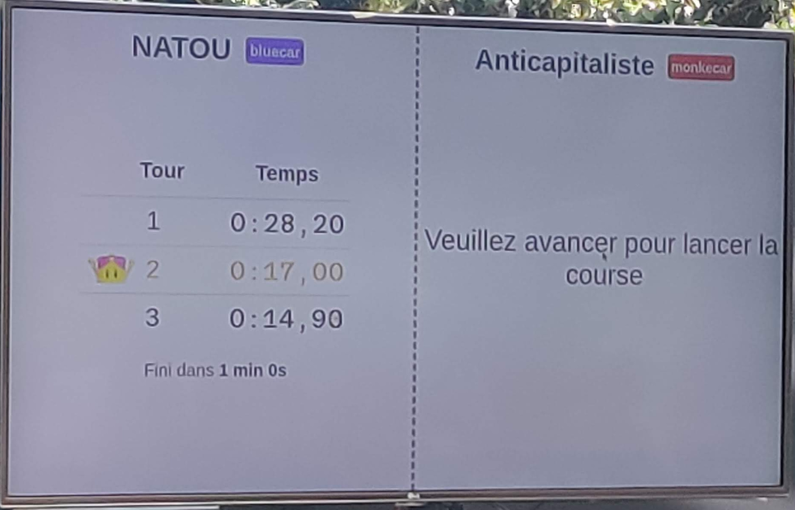

# donkeycar manager frontend

> A Vue.js project

## Frontend views : 

The donkeycar manager is composed of multiples parts : 

### Register 

- add jobs in waiting list

### Car view
- see current laps time and those before
- display cars who running, their color and their job (player) affected
- display waiting list

### admin dashboard :
-  see players ( jobs ) in waiting list
-  manage jobs in the waiting list (remove, upgrade his rank, downgrade)
- differents cars with their current job, status
- total player who subscribe in register login 

## Build Setup

``` bash
# install dependencies
npm install

# serve with hot reload at localhost:8080
npm run dev

# build for production with minification
npm run build

# build for production and view the bundle analyzer report
npm run build --report
```
For a detailed explanation on how things work, check out the [guide](http://vuejs-templates.github.io/webpack/) and [docs for vue-loader](http://vuejs.github.io/vue-loader).

## Views

client login :
`http://localhost:8080/#/`

waiting board :
`http://localhost:8080/#/waitingBoard`

admin dashboard :
`http://localhost:8080/#/dashboard`

## Others docs:
- [Websocket documentation](doc/donkeycarManager/events.md)
- [manager features documentation](doc/donkeycarManager/manager-features.md)
- [data structure diagram](../doc/donkeycarManager/DataStructure.png)

## Controller icons for the screen\_msg of jobs

The icons are parsed from the message, any `[<name>]` will become an icon

Available icons are:
 - Circle
 - Cross
 - Diagram
 - Diagram\_Simple
 - Dpad\_Down
 - Dpad\_Left
 - Dpad
 - Dpad\_Right
 - Dpad\_Up
 - L1
 - L2
 - Left\_Stick\_Click
 - Left\_Stick
 - Options
 - R1
 - R2
 - Right\_Stick\_Click
 - Right\_Stick
 - Share
 - Square
 - Touch\_Pad
 - Triangle


## 📷 Screenshot :

***
<br> 

